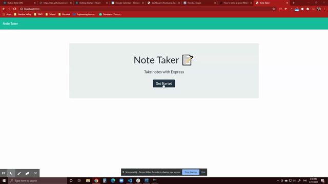

# Note Taker

## Description
This Note Taker allows a small business owner to be able to write and save notes so that they can organize their tasks and thoughts needing attention. This note taker will allow you to click on the link to the notes pageand see all of your existing notes on the left side. On the right side, there is an area to add a new note and once completed will allow you to save the note. Once saved, you will see your note appear on the left side with existing notes.

***
## Table of Contents
* [Installation](#installation)
* [Usage](#usage)
* [Contributors](#contributors)
* [Tests](#tests)
* [Questions](#questions)
* [License](#License)

***
## Installation
Once you have downloaded all of your files, please run an npm install to install all of the associated packages.

***
## Usage
This project is deployed on Heroku. If you are downloading this project, you will need to run node server.js to launch the project locally.

***
## Contributors
This project was created by Dana Corona.

***
## Tests
None

***
## Questions
For questions about this project please reach out to me!

[My Github Account]('https://github.com/danacorona')

[My Email]('dana.d.corona@gmail.com')

***
## License

***
## Walkthrough Video
